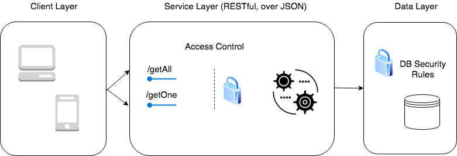

# employees-services

### Build Status

### Description
Server-less micro-services backed by Google Cloud Platform (Firebase BaaS). Two functions exposed by endpoints, which are protected by Access Control mechanism - Firebase Auth:
1. `/getAll` - returns a list of entities from the Firebase Real-Time Database.
1. `/getOne?id=:id` - returns a single entity from the Firebase Real-Time Database, based on a provided ID value.

Both endpoints operate using the Firebase Admin SDK, in order to validate the ID token passed within the HTTP request.

### Architectural Overview
